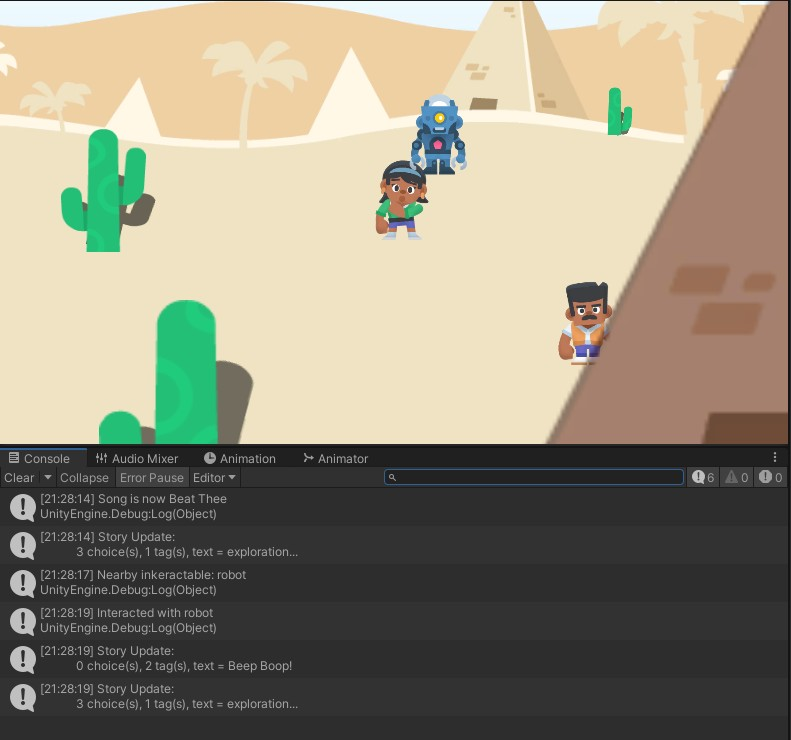

# Ballpoint: Friendly Wrapper for Ink ( on Unity )

Helper tools to make using Inkle's Ink in Unity easier, primarily through inspector-friendly wrapper classes.

Requires Unity 2020.1 or newer. Must have [Ink Unity Integration](https://github.com/inkle/ink-unity-integration) pre-installed or install [via OpenUPM](https://openupm.com/packages/org.samsarette.ballpoint-unity).

Documentation is at [Documentation~/Ballpoint.md](Documentation~/Ballpoint.md).

## Examples

### Dialog Boxes

### Speech Bubbles

### Explorative Choices

### Inventory Management

### Inspector

